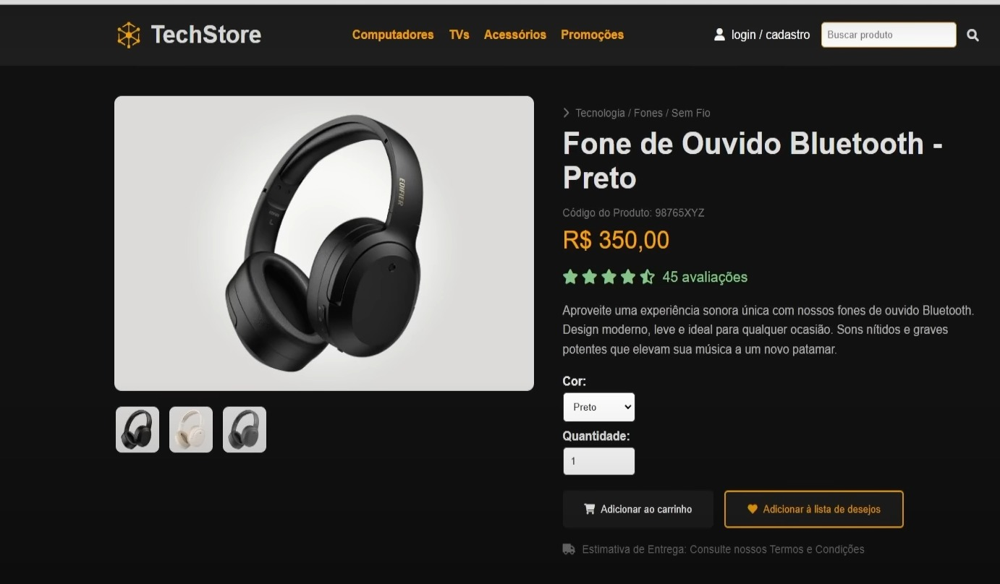

### Iniciando um carrinho
* HTML
* CSS
* Javascript

> #### Imagens


> #### Iniciando o projeto
* CDN Icones
```
<link rel="stylesheet" href="https://cdnjs.cloudflare.com/ajax/libs/font-awesome/6.0.0-beta3/css/all.min.css" />
```

> #### Link para baixar
* CDN Icones
```
colocor do google driver
```

> #### Ref
* Matheus Batisti
```
https://www.youtube.com/watch?v=FjsyDL3hxis&t=1359s
```